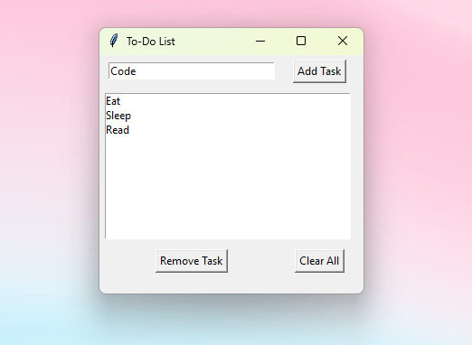

# Python To-Do List GUI Application

This application is a graphical user interface (GUI) version of a To-Do List manager implemented in Python. It demonstrates various programming concepts and provides a user-friendly interface for task management.

 

## Features

- Add new tasks to the list
- Display all tasks in a scrollable list
- Remove selected tasks
- Clear all tasks at once
- Persistent storage (tasks are saved between sessions)
- User-friendly graphical interface

## Concepts Demonstrated

1. **Graphical User Interface (GUI) Programming**: 
   - Uses the `tkinter` library to create a window-based application
   - Demonstrates the use of various GUI elements (buttons, entry fields, listboxes)

2. **Object-Oriented Programming (OOP)**: 
   - Utilizes classes to organize code (`TodoList` and `TodoApp`)
   - Demonstrates inheritance (`TodoApp` inherits from `tk.Tk`)

3. **Event-Driven Programming**: 
   - GUI responds to user actions (button clicks, selections)
   - Uses callback functions to handle events

4. **File I/O**: 
   - Saves tasks to and loads them from a text file
   - Demonstrates reading from and writing to files in Python

5. **Error Handling and User Feedback**:
   - Uses `messagebox` to display warnings and confirmation dialogs
   - Implements input validation (e.g., preventing addition of empty tasks)

6. **Python Standard Library Usage**:
   - Utilizes `os` module for file operations
   - Uses `tkinter` for GUI creation

7. **Data Structures**:
   - Uses lists to store and manage tasks

## How to Use

1. Ensure you have Python installed on your system (Python 3.x recommended).
2. Save the provided code in a file named `todo_list_gui.py`.
3. Open a terminal or command prompt and navigate to the directory containing the file.
4. Run the script by entering:
   ```
   python todo_list_gui.py
   ```
   If that doesn't work, try `python3 todo_list_gui.py` or `py todo_list_gui.py`.
5. The GUI window will appear. You can now:
   - Enter a task in the text field and click "Add Task" or press Enter
   - Select a task and click "Remove Task" to delete it
   - Click "Clear All" to remove all tasks (with confirmation)
   - Close the window to exit the application

## Technical Details

- The application creates a file named `tasks.txt` in the same directory to store tasks.
- Tasks are saved automatically whenever they are added, removed, or cleared.
- The `TodoList` class handles the core functionality (adding, removing, saving, and loading tasks).
- The `TodoApp` class manages the GUI and user interactions.

## Potential Enhancements

- Add due dates to tasks
- Implement task priorities
- Allow editing of existing tasks
- Add categories or tags to tasks
- Implement sorting and filtering options
- Create a dark mode or theme options
- Add keyboard shortcuts for common actions

## Learning Outcomes

By studying and extending this application, you can gain practical experience in:
- Building graphical interfaces with tkinter
- Implementing CRUD (Create, Read, Update, Delete) operations
- Managing program state and persistent storage
- Handling user input and providing feedback
- Structuring a Python application using OOP principles

Feel free to fork this project and add your own enhancements!
